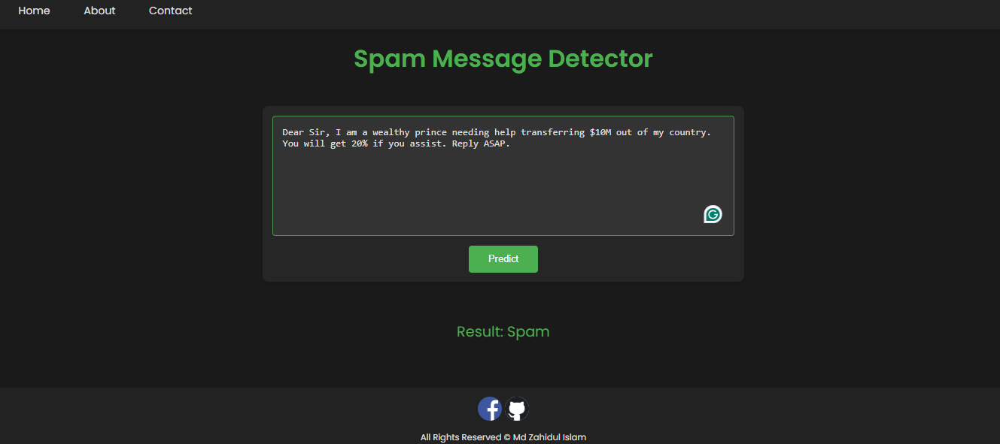

# Spam Detection using Machine Learning & Web App 🛡️
A comprehensive collection of machine learning and deep learning models for spam detection, deployed as a Flask web application with real-time prediction.

# Features
## ✅ Machine Learning Models

- Naive Bayes

- Support Vector Machines (SVM) (99.11% Max in Machine Learning Models)

- Random Forest

- Logistic Regression

- AdaBoost

- XGBoost

- Ensemble Learning

## ✅ Deep Learning Models

- LSTM

- BERT (99.79% Max in Deep Learning Models)

## ✅ Web Application

- Real-time spam prediction

- User-friendly Flask interface

- Contact form with email notifications

- Responsive frontend

## ✅ Technical Highlights

- Cross-validation for model evaluation

- Customizable preprocessing (TF-IDF, lemmatization, etc.)

# Web Application Interface

# Conclusion:
This repository provides a comprehensive collection of machine learning models for spam detection, including both traditional algorithms and deep learning models.
The models can be used for email or text-based spam detection in various applications. 
Additionally, the repository supports different data preprocessing techniques and includes cross-validation for model evaluation.
